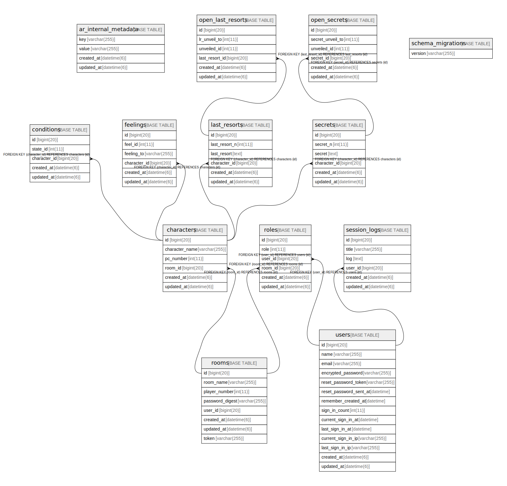

# shinobi_assist_31491_development

## Tables

| Name | Columns | Comment | Type |
| ---- | ------- | ------- | ---- |
| [ar_internal_metadata](ar_internal_metadata.md) | 4 |  | BASE TABLE |
| [characters](characters.md) | 6 |  | BASE TABLE |
| [conditions](conditions.md) | 5 |  | BASE TABLE |
| [feelings](feelings.md) | 6 |  | BASE TABLE |
| [last_resorts](last_resorts.md) | 6 |  | BASE TABLE |
| [open_last_resorts](open_last_resorts.md) | 6 |  | BASE TABLE |
| [open_secrets](open_secrets.md) | 6 |  | BASE TABLE |
| [roles](roles.md) | 6 |  | BASE TABLE |
| [rooms](rooms.md) | 8 |  | BASE TABLE |
| [schema_migrations](schema_migrations.md) | 1 |  | BASE TABLE |
| [secrets](secrets.md) | 6 |  | BASE TABLE |
| [session_logs](session_logs.md) | 6 |  | BASE TABLE |
| [users](users.md) | 14 |  | BASE TABLE |

## Relations

---

> Generated by [tbls](https://github.com/k1LoW/tbls)
