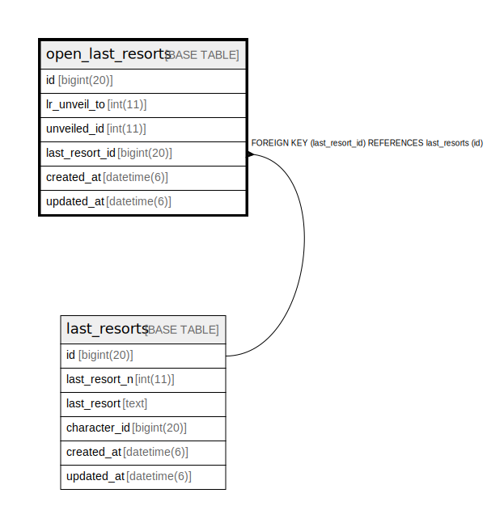

# open_last_resorts

## Description

<details>
<summary><strong>Table Definition</strong></summary>

```sql
CREATE TABLE `open_last_resorts` (
  `id` bigint(20) NOT NULL AUTO_INCREMENT,
  `lr_unveil_to` int(11) NOT NULL,
  `unveiled_id` int(11) NOT NULL,
  `last_resort_id` bigint(20) NOT NULL,
  `created_at` datetime(6) NOT NULL,
  `updated_at` datetime(6) NOT NULL,
  PRIMARY KEY (`id`),
  KEY `index_open_last_resorts_on_last_resort_id` (`last_resort_id`),
  CONSTRAINT `fk_rails_53c67430bb` FOREIGN KEY (`last_resort_id`) REFERENCES `last_resorts` (`id`)
) ENGINE=InnoDB AUTO_INCREMENT=[Redacted by tbls] DEFAULT CHARSET=utf8
```

</details>

## Columns

| Name | Type | Default | Nullable | Extra Definition | Children | Parents | Comment |
| ---- | ---- | ------- | -------- | --------------- | -------- | ------- | ------- |
| id | bigint(20) |  | false | auto_increment |  |  |  |
| lr_unveil_to | int(11) |  | false |  |  |  |  |
| unveiled_id | int(11) |  | false |  |  |  |  |
| last_resort_id | bigint(20) |  | false |  |  | [last_resorts](last_resorts.md) |  |
| created_at | datetime(6) |  | false |  |  |  |  |
| updated_at | datetime(6) |  | false |  |  |  |  |

## Constraints

| Name | Type | Definition |
| ---- | ---- | ---------- |
| fk_rails_53c67430bb | FOREIGN KEY | FOREIGN KEY (last_resort_id) REFERENCES last_resorts (id) |
| PRIMARY | PRIMARY KEY | PRIMARY KEY (id) |

## Indexes

| Name | Definition |
| ---- | ---------- |
| index_open_last_resorts_on_last_resort_id | KEY index_open_last_resorts_on_last_resort_id (last_resort_id) USING BTREE |
| PRIMARY | PRIMARY KEY (id) USING BTREE |

## Relations



---

> Generated by [tbls](https://github.com/k1LoW/tbls)
