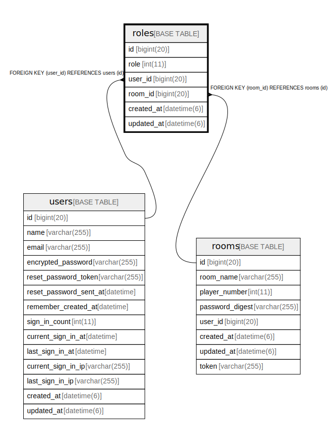

# roles

## Description

<details>
<summary><strong>Table Definition</strong></summary>

```sql
CREATE TABLE `roles` (
  `id` bigint(20) NOT NULL AUTO_INCREMENT,
  `role` int(11) NOT NULL,
  `user_id` bigint(20) NOT NULL,
  `room_id` bigint(20) NOT NULL,
  `created_at` datetime(6) NOT NULL,
  `updated_at` datetime(6) NOT NULL,
  PRIMARY KEY (`id`),
  KEY `index_roles_on_user_id` (`user_id`),
  KEY `index_roles_on_room_id` (`room_id`),
  CONSTRAINT `fk_rails_ab35d699f0` FOREIGN KEY (`user_id`) REFERENCES `users` (`id`),
  CONSTRAINT `fk_rails_ebad17fbf8` FOREIGN KEY (`room_id`) REFERENCES `rooms` (`id`)
) ENGINE=InnoDB AUTO_INCREMENT=[Redacted by tbls] DEFAULT CHARSET=utf8
```

</details>

## Columns

| Name | Type | Default | Nullable | Extra Definition | Children | Parents | Comment |
| ---- | ---- | ------- | -------- | --------------- | -------- | ------- | ------- |
| id | bigint(20) |  | false | auto_increment |  |  |  |
| role | int(11) |  | false |  |  |  |  |
| user_id | bigint(20) |  | false |  |  | [users](users.md) |  |
| room_id | bigint(20) |  | false |  |  | [rooms](rooms.md) |  |
| created_at | datetime(6) |  | false |  |  |  |  |
| updated_at | datetime(6) |  | false |  |  |  |  |

## Constraints

| Name | Type | Definition |
| ---- | ---- | ---------- |
| fk_rails_ab35d699f0 | FOREIGN KEY | FOREIGN KEY (user_id) REFERENCES users (id) |
| fk_rails_ebad17fbf8 | FOREIGN KEY | FOREIGN KEY (room_id) REFERENCES rooms (id) |
| PRIMARY | PRIMARY KEY | PRIMARY KEY (id) |

## Indexes

| Name | Definition |
| ---- | ---------- |
| index_roles_on_room_id | KEY index_roles_on_room_id (room_id) USING BTREE |
| index_roles_on_user_id | KEY index_roles_on_user_id (user_id) USING BTREE |
| PRIMARY | PRIMARY KEY (id) USING BTREE |

## Relations



---

> Generated by [tbls](https://github.com/k1LoW/tbls)
