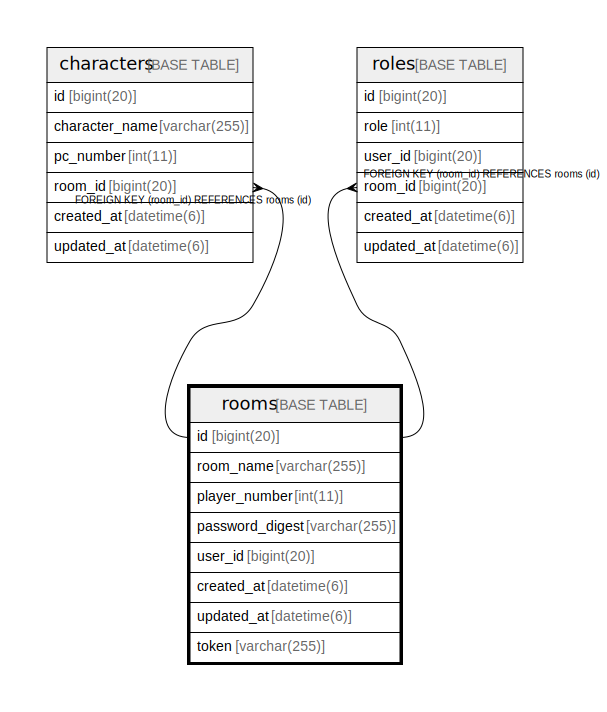

# rooms

## Description

<details>
<summary><strong>Table Definition</strong></summary>

```sql
CREATE TABLE `rooms` (
  `id` bigint(20) NOT NULL AUTO_INCREMENT,
  `room_name` varchar(255) NOT NULL,
  `player_number` int(11) NOT NULL,
  `password_digest` varchar(255) DEFAULT NULL,
  `user_id` bigint(20) NOT NULL,
  `created_at` datetime(6) NOT NULL,
  `updated_at` datetime(6) NOT NULL,
  `token` varchar(255) DEFAULT NULL,
  PRIMARY KEY (`id`),
  KEY `index_rooms_on_user_id` (`user_id`)
) ENGINE=InnoDB AUTO_INCREMENT=[Redacted by tbls] DEFAULT CHARSET=utf8
```

</details>

## Columns

| Name | Type | Default | Nullable | Extra Definition | Children | Parents | Comment |
| ---- | ---- | ------- | -------- | --------------- | -------- | ------- | ------- |
| id | bigint(20) |  | false | auto_increment | [characters](characters.md) [roles](roles.md) |  |  |
| room_name | varchar(255) |  | false |  |  |  |  |
| player_number | int(11) |  | false |  |  |  |  |
| password_digest | varchar(255) |  | true |  |  |  |  |
| user_id | bigint(20) |  | false |  |  |  |  |
| created_at | datetime(6) |  | false |  |  |  |  |
| updated_at | datetime(6) |  | false |  |  |  |  |
| token | varchar(255) |  | true |  |  |  |  |

## Constraints

| Name | Type | Definition |
| ---- | ---- | ---------- |
| PRIMARY | PRIMARY KEY | PRIMARY KEY (id) |

## Indexes

| Name | Definition |
| ---- | ---------- |
| index_rooms_on_user_id | KEY index_rooms_on_user_id (user_id) USING BTREE |
| PRIMARY | PRIMARY KEY (id) USING BTREE |

## Relations



---

> Generated by [tbls](https://github.com/k1LoW/tbls)
