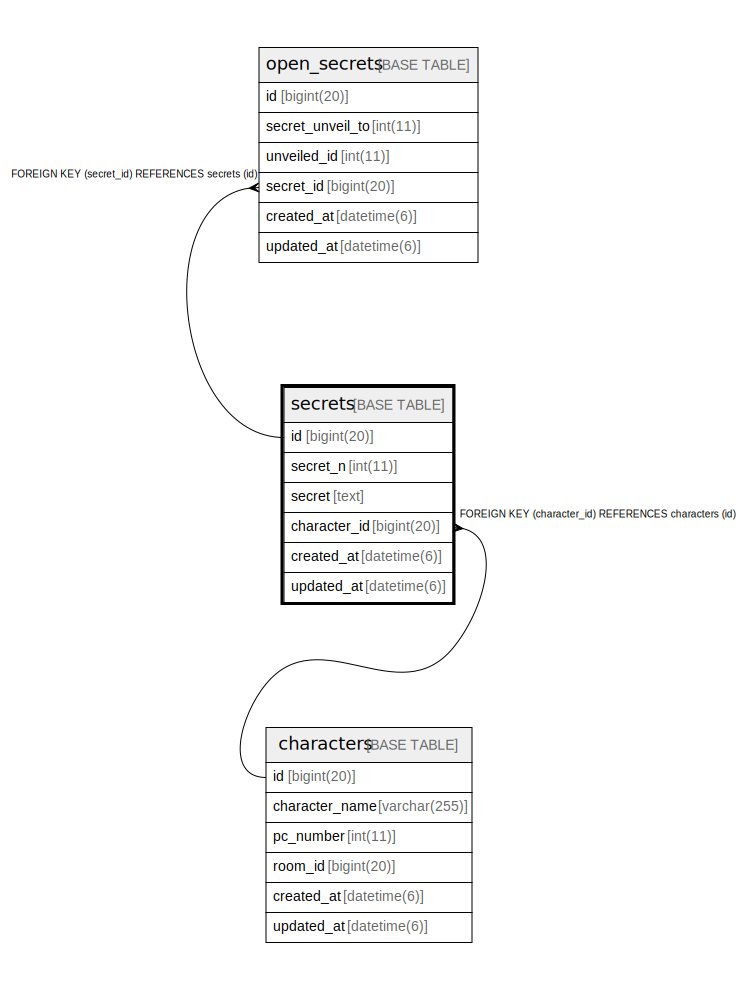

# secrets

## Description

<details>
<summary><strong>Table Definition</strong></summary>

```sql
CREATE TABLE `secrets` (
  `id` bigint(20) NOT NULL AUTO_INCREMENT,
  `secret_n` int(11) NOT NULL,
  `secret` text NOT NULL,
  `character_id` bigint(20) NOT NULL,
  `created_at` datetime(6) NOT NULL,
  `updated_at` datetime(6) NOT NULL,
  PRIMARY KEY (`id`),
  KEY `index_secrets_on_character_id` (`character_id`),
  CONSTRAINT `fk_rails_fbe986f5f0` FOREIGN KEY (`character_id`) REFERENCES `characters` (`id`)
) ENGINE=InnoDB AUTO_INCREMENT=[Redacted by tbls] DEFAULT CHARSET=utf8
```

</details>

## Columns

| Name | Type | Default | Nullable | Extra Definition | Children | Parents | Comment |
| ---- | ---- | ------- | -------- | --------------- | -------- | ------- | ------- |
| id | bigint(20) |  | false | auto_increment | [open_secrets](open_secrets.md) |  |  |
| secret_n | int(11) |  | false |  |  |  |  |
| secret | text |  | false |  |  |  |  |
| character_id | bigint(20) |  | false |  |  | [characters](characters.md) |  |
| created_at | datetime(6) |  | false |  |  |  |  |
| updated_at | datetime(6) |  | false |  |  |  |  |

## Constraints

| Name | Type | Definition |
| ---- | ---- | ---------- |
| fk_rails_fbe986f5f0 | FOREIGN KEY | FOREIGN KEY (character_id) REFERENCES characters (id) |
| PRIMARY | PRIMARY KEY | PRIMARY KEY (id) |

## Indexes

| Name | Definition |
| ---- | ---------- |
| index_secrets_on_character_id | KEY index_secrets_on_character_id (character_id) USING BTREE |
| PRIMARY | PRIMARY KEY (id) USING BTREE |

## Relations



---

> Generated by [tbls](https://github.com/k1LoW/tbls)
