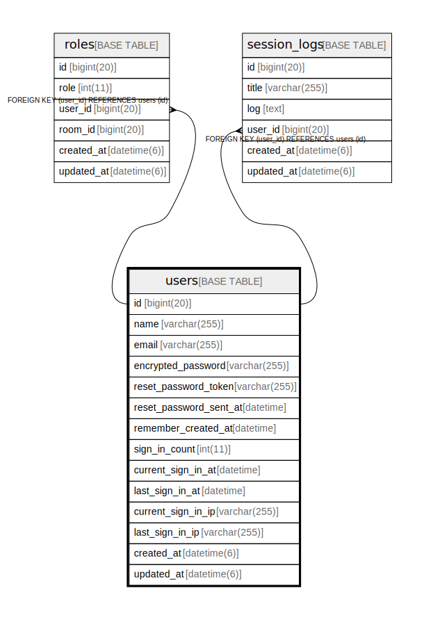

# users

## Description

<details>
<summary><strong>Table Definition</strong></summary>

```sql
CREATE TABLE `users` (
  `id` bigint(20) NOT NULL AUTO_INCREMENT,
  `name` varchar(255) NOT NULL,
  `email` varchar(255) NOT NULL DEFAULT '',
  `encrypted_password` varchar(255) NOT NULL DEFAULT '',
  `reset_password_token` varchar(255) DEFAULT NULL,
  `reset_password_sent_at` datetime DEFAULT NULL,
  `remember_created_at` datetime DEFAULT NULL,
  `sign_in_count` int(11) NOT NULL DEFAULT '0',
  `current_sign_in_at` datetime DEFAULT NULL,
  `last_sign_in_at` datetime DEFAULT NULL,
  `current_sign_in_ip` varchar(255) DEFAULT NULL,
  `last_sign_in_ip` varchar(255) DEFAULT NULL,
  `created_at` datetime(6) NOT NULL,
  `updated_at` datetime(6) NOT NULL,
  PRIMARY KEY (`id`),
  UNIQUE KEY `index_users_on_email` (`email`),
  UNIQUE KEY `index_users_on_reset_password_token` (`reset_password_token`)
) ENGINE=InnoDB AUTO_INCREMENT=[Redacted by tbls] DEFAULT CHARSET=utf8
```

</details>

## Columns

| Name | Type | Default | Nullable | Extra Definition | Children | Parents | Comment |
| ---- | ---- | ------- | -------- | --------------- | -------- | ------- | ------- |
| id | bigint(20) |  | false | auto_increment | [roles](roles.md) [session_logs](session_logs.md) |  |  |
| name | varchar(255) |  | false |  |  |  |  |
| email | varchar(255) |  | false |  |  |  |  |
| encrypted_password | varchar(255) |  | false |  |  |  |  |
| reset_password_token | varchar(255) |  | true |  |  |  |  |
| reset_password_sent_at | datetime |  | true |  |  |  |  |
| remember_created_at | datetime |  | true |  |  |  |  |
| sign_in_count | int(11) | 0 | false |  |  |  |  |
| current_sign_in_at | datetime |  | true |  |  |  |  |
| last_sign_in_at | datetime |  | true |  |  |  |  |
| current_sign_in_ip | varchar(255) |  | true |  |  |  |  |
| last_sign_in_ip | varchar(255) |  | true |  |  |  |  |
| created_at | datetime(6) |  | false |  |  |  |  |
| updated_at | datetime(6) |  | false |  |  |  |  |

## Constraints

| Name | Type | Definition |
| ---- | ---- | ---------- |
| index_users_on_email | UNIQUE | UNIQUE KEY index_users_on_email (email) |
| index_users_on_reset_password_token | UNIQUE | UNIQUE KEY index_users_on_reset_password_token (reset_password_token) |
| PRIMARY | PRIMARY KEY | PRIMARY KEY (id) |

## Indexes

| Name | Definition |
| ---- | ---------- |
| PRIMARY | PRIMARY KEY (id) USING BTREE |
| index_users_on_email | UNIQUE KEY index_users_on_email (email) USING BTREE |
| index_users_on_reset_password_token | UNIQUE KEY index_users_on_reset_password_token (reset_password_token) USING BTREE |

## Relations



---

> Generated by [tbls](https://github.com/k1LoW/tbls)
